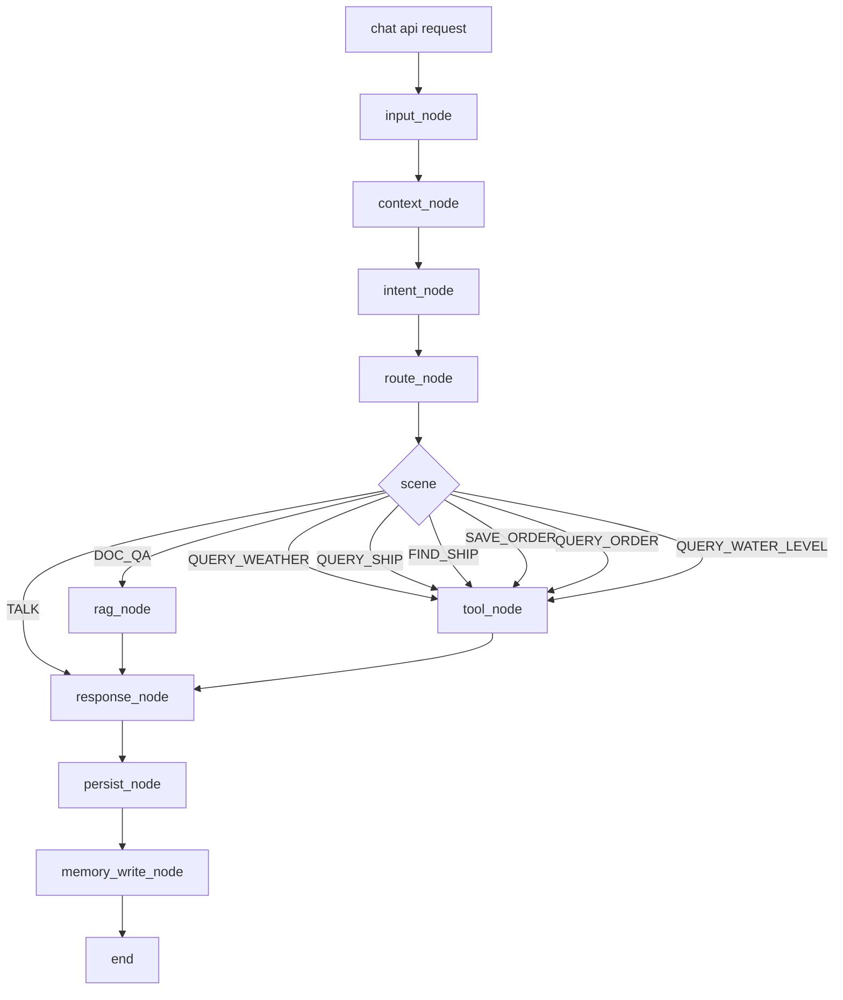
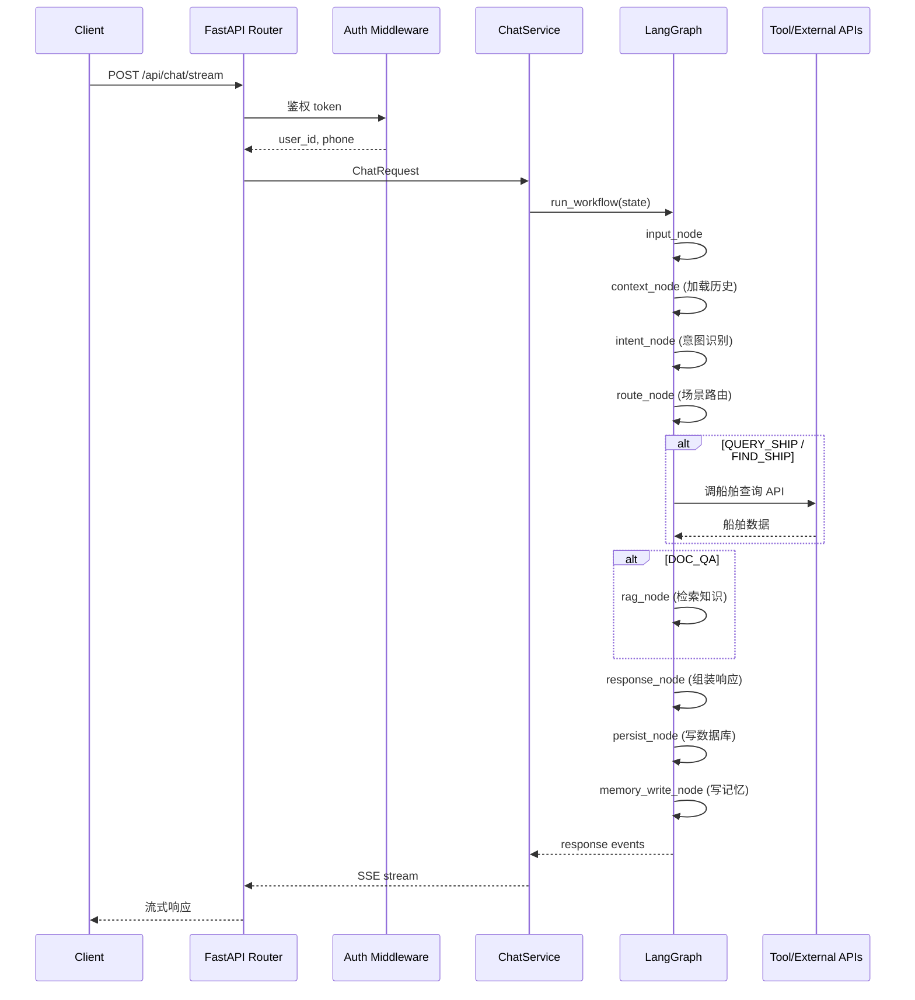
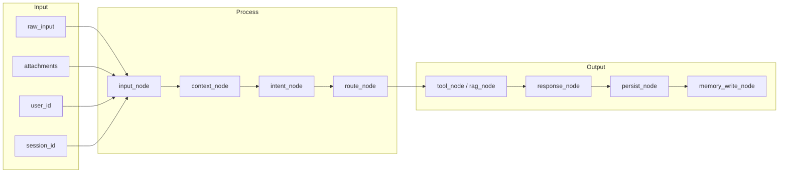
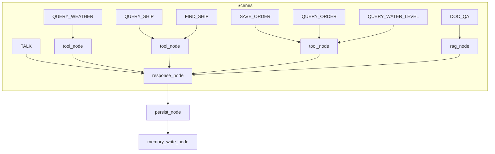
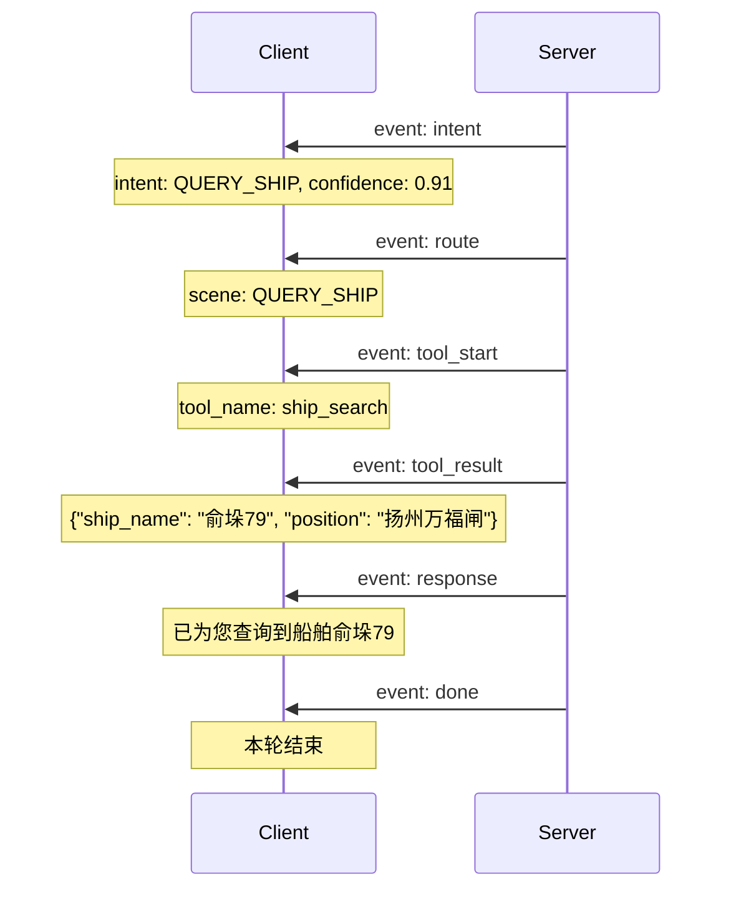
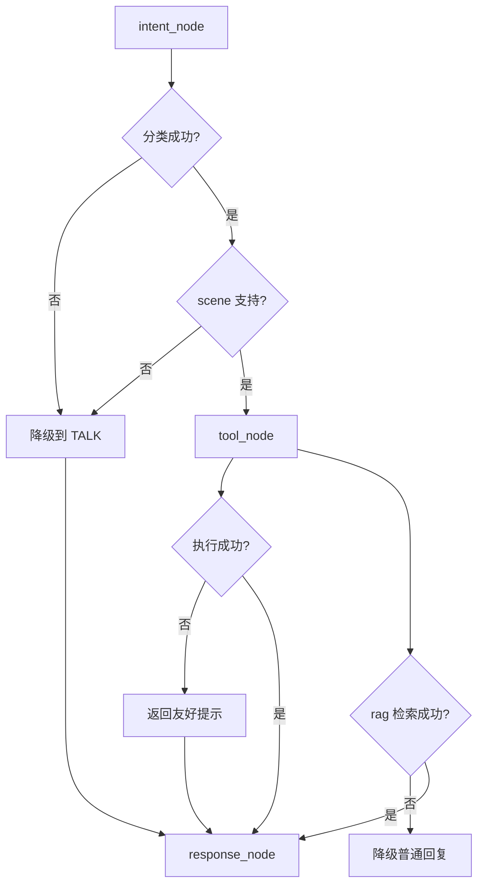
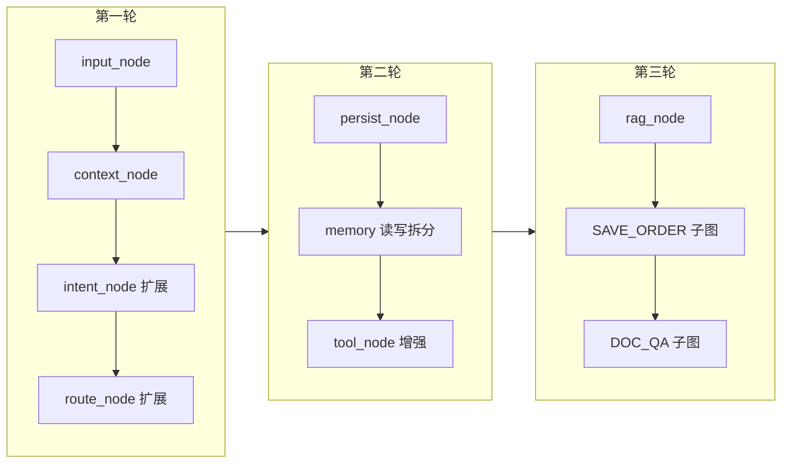

# 原始流程对应 LangGraph 设计

## 1. 文档目标

基于 [03-AI-BE4J原始流程梳理](../AI-BE4J版本记录/03-AI-BE4J原始流程梳理.md)，输出一份面向 `ai-be-py` 的对应设计。

这份设计回答三个问题：

1. Java 版原始主链路在 `LangGraph` 下应该如何映射
2. 哪些能力应该进入 Graph，哪些应继续留在 Service / Infra / Tool
3. 当前 `ai-be-py` 第一版最小图，下一步应该如何演进成贴近原始系统的结构

本文不是 Java 代码翻译，也不是最终生产架构全量说明，而是"原始流程 -> Python LangGraph 重构方案"的桥接设计。

---

## 2. 设计结论

`ai-be-master` 的原始链路：

```text
Controller
  -> Auth / User Context
  -> AiRequestFacade
  -> InputProcessor
  -> IntentRecognizer
  -> SceneRouter
  -> FlowEngineProcessor
  -> Tool / LLM / Memory / Knowledge / DB
```

在 `ai-be-py` 中不建议照搬成一个"大 Facade + 大 FlowEngine"，而应拆成：

```text
FastAPI Router
  -> Auth Middleware / Deps
  -> ChatService
  -> ChatWorkflow (LangGraph)
      -> input_node
      -> context_node
      -> intent_node
      -> route_node
      -> scene nodes
      -> response_node
      -> persist_node
  -> SSE Stream
```

其中：

- `Graph` 负责"决策与编排"
- `Service` 负责"聚合和运行组织"
- `Tool / Infra` 负责"执行能力"
- `Repository` 负责"落库与查询"

---

## 3. 核心映射关系

### 3.1 Java 到 LangGraph 映射表

| Java 原始模块 | 原始职责 | LangGraph 对应设计 | 落地位置 |
|---|---|---|---|
| `ChatController` | 对话入口、注入登录用户 | `chat router + auth deps` | `backend/api/routers/chat.py` |
| `PilotAuthInterceptor` / `DefaultAuthInterceptor` | 鉴权与用户上下文注入 | `middleware / dependency` | `backend/auth/*`、`backend/api/deps.py` |
| `AiRequestFacade` | 主链路统一编排 | `ChatService + ChatWorkflow` | `backend/services/chat_service.py`、`backend/graph/workflows/chat_workflow.py` |
| `InputProcessor` | 文本/附件/OCR 预处理 | `input_node` 或 graph 前预处理 | `backend/graph/nodes/input_node.py` |
| `IntentRecognizer` | 规则、LLM、守卫、上下文识别 | `context_node + intent_node(+guard)` | `backend/graph/nodes/*`、`backend/services/intent_service.py` |
| `SceneRouter` | SceneContext 装配 | `route_node` | `backend/graph/nodes/routing_node.py` |
| `FlowEngineProcessor` | 场景执行中心 | `scene subgraph / tool node / rag node / memory node / response node` | `backend/graph/workflows/scene_workflows/*` |
| `ToolExecutor` / `core/tool/*` | 工具执行 | `tool_node + registry` | `backend/graph/nodes/tool_node.py`、`backend/tools/*` |
| `UserMemoryService` / `WorkingMemoryService` | 用户记忆、任务记忆 | `memory_load_node + memory_write_node` | `backend/graph/nodes/memory_node.py`、`backend/services/*` |
| `KnowledgeVectorService` 等 | 检索增强 | `rag_node` | `backend/graph/nodes/rag_node.py` |
| `ChatLogMapper` 等 | 对话日志落库 | `persist_node` | `backend/infra/database/repositories/*` |

### 3.2 一个重要判断

Java 版里最重的是 `FlowEngineProcessor`，而 LangGraph 迁移的关键，就是把它从"按 scene 分支的大函数"拆成：

- 通用节点
- 场景子图
- 节点内部调用的 service/tool

也就是说，迁移的重点不是把 `IntentRecognizer` 变成一个 prompt，而是把 `FlowEngineProcessor` 变成图。

---

## 4. 目标架构设计

### 4.1 分层设计

```text
Client
  -> FastAPI API Layer       [接收请求、参数校验、流式输出]
  -> Auth Layer              [token 校验、用户上下文注入]
  -> ChatService             [组装工作流输入、控制运行模式]
  -> LangGraph Workflow     [场景决策、状态流转、节点编排]
  -> Domain Service / Tool  [业务工具、外部系统适配]
  -> Infra Layer             [LLM、DB、缓存、HTTP 客户端]
  -> DB / Redis / LLM / External APIs
```

### 4.2 分层职责

| 层 | 职责 | 不负责 |
|---|---|---|
| API | 接收请求、参数校验、流式输出、绑定用户 | 不负责业务决策 |
| Auth | token 校验、用户上下文注入 | 不负责场景编排 |
| Service | 组装工作流输入、控制运行模式、处理流式输出 | 不负责具体业务规则细节 |
| Graph | 场景决策、状态流转、节点编排、分支控制 | 不直接访问底层数据库细节 |
| Domain/Tools | 业务工具、外部系统适配、结构化能力 | 不负责用户接口协议 |
| Infra/Repo | LLM、DB、缓存、HTTP 客户端、观测 | 不负责场景判断 |

### 4.3 分层架构图

```
┌─────────────────────────────────────────────────────────┐
│                    Client (前端)                         │
└─────────────────────────┬───────────────────────────────┘
                          │ HTTP / SSE
                          ▼
┌─────────────────────────────────────────────────────────┐
│              FastAPI API Layer                           │
│         [接收请求、参数校验、流式输出]                    │
└─────────────────────────┬───────────────────────────────┘
                          │
                          ▼
┌─────────────────────────────────────────────────────────┐
│              Auth Layer                                 │
│      [token 校验、用户上下文注入]                        │
└─────────────────────────┬───────────────────────────────┘
                          │
                          ▼
┌─────────────────────────────────────────────────────────┐
│              ChatService                                │
│      [组装工作流输入、控制运行模式、处理流式输出]          │
└─────────────────────────┬───────────────────────────────┘
                          │
                          ▼
┌─────────────────────────────────────────────────────────┐
│            LangGraph Workflow Layer                     │
│                                                          │
│   input_node → context_node → intent_node → route_node  │
│       ↓              ↓           ↓            ↓           │
│   工具选择/上下文加载 意图识别   场景路由                 │
│                                                          │
│       ↓              ↓           ↓            ↓           │
│   persist_node → memory_write_node → response_node      │
│   [持久化]            [记忆写回]        [响应组装]       │
└─────────────────────────┬───────────────────────────────┘
                          │
                          ▼
┌─────────────────────────────────────────────────────────┐
│           Domain Service / Tool Layer                  │
│     [业务工具、外部系统适配、结构化能力]                  │
└─────────────────────────┬───────────────────────────────┘
                          │
                          ▼
┌─────────────────────────────────────────────────────────┐
│              Infra Layer                               │
│        [LLM、DB、缓存、HTTP 客户端、观测]                │
└─────────────────────────────────────────────────────────┘
```

---

## 5. LangGraph 目标主流程

### 5.1 主图演进路径

**当前最小图：**
```text
intent -> routing -> tool/response -> memory
```

**目标完整图：**
```text
input -> context -> intent -> route -> scene_entry
      -> tool / rag / ask_user / direct_llm
  -> response -> persist -> memory_write -> end
```

### 5.2 主流程图



### 5.3 请求生命周期图



---

## 6. 节点设计

### 6.1 `input_node`

对应 Java 的 `InputProcessor`。

职责：
- 接收原始文本
- 处理附件元数据
- 若有图片则执行 OCR
- 合并 OCR 文本与用户输入
- 产出规范化输入

**输入状态：**
- `raw_input`
- `attachments`
- `user_id`
- `session_id`

**输出状态：**
- `normalized_input`
- `attachment_texts`
- `input_meta`

---

### 6.2 `context_node`

职责：
- 加载最近历史消息
- 加载 working memory
- 加载用户长期画像
- 构造意图识别上下文

**输出状态：**
- `history`
- `working_memory`
- `user_profile`
- `intent_context`

**context_node 工作示意图：**

```
┌─────────────────────────────────────┐
│           context_node              │
│                                     │
│  ┌───────────┐    ┌───────────┐    │
│  │ 历史消息  │    │ Working   │    │
│  │ (最近N轮) │    │ Memory    │    │
│  └─────┬─────┘    └─────┬─────┘    │
│        │                │          │
│        └───────┬────────┘          │
│                ▼                   │
│         ┌──────────────┐           │
│         │  上下文融合  │           │
│         └──────┬───────┘           │
│                │                   │
│                ▼                   │
│         intent_context             │
│         (含 history + memory)       │
└─────────────────────────────────────┘
```

---

### 6.3 `intent_node`

对应 Java 的 `IntentRecognizer`，内部建议分三层：

```
┌─────────────────────────────────────────┐
│            intent_node                  │
│                                         │
│  ┌─────────┐   ┌─────────┐   ┌────────┐ │
│  │ 规则识别 │──▶│LLM分类 │──▶│守卫修正│ │
│  │ (L0)    │   │  (L1)  │   │ (L2)  │ │
│  └─────────┘   └─────────┘   └────────┘ │
│      │              │            │    │
│      └──────────────┴────────────┘     │
│                    │                   │
│                    ▼                   │
│              intent + slots           │
│              + need_clarify            │
└─────────────────────────────────────────┘
```

**输出状态：**
- `intent`
- `scene`
- `intent_meta`
- `need_clarify`

---

### 6.4 `route_node`

职责：
- 标准化 scene
- 组装下游执行参数
- 决定进入哪个 scene 子图

**输出状态：**
- `scene`
- `scene_params`
- `execution_mode`

---

### 6.5 `tool_node`

职责：
- 根据 `scene` 选择工具
- 构造标准化入参
- 执行超时控制 / 熔断 / 错误包装
- 返回结构化结果

**tool_node 执行流程：**

```
┌─────────────────────────────────────────┐
│            tool_node                     │
│                                         │
│  输入：scene + slots                     │
│                 │                       │
│                 ▼                       │
│         ┌─────────────┐                │
│         │ 工具选择器  │                │
│         │(scene映射)  │                │
│         └──────┬──────┘                │
│                │                        │
│                ▼                        │
│         ┌─────────────┐                │
│         │ 参数构造器  │                │
│         │(slots填充)  │                │
│         └──────┬──────┘                │
│                │                        │
│     ┌──────────┴──────────┐             │
│     ▼                     ▼             │
│ ┌────────┐           ┌────────┐         │
│ │超时控制│           │熔断器  │         │
│ └───────┘           └────────┘         │
│     │                     │             │
│     └──────────┬──────────┘             │
│                ▼                        │
│         ┌─────────────┐                │
│         │ 执行工具    │                │
│         └──────┬──────┘                │
│                │                        │
│                ▼                        │
│         tool_result                     │
└─────────────────────────────────────────┘
```

**输出状态：**
- `tool_name`
- `tool_args`
- `tool_result`
- `tool_error`

---

### 6.6 `rag_node`

对应 Java 的知识增强链路。

职责：
- 检索知识片段
- rerank
- 产出 `retrieved_docs`
- 为响应节点构造增强上下文

**rag_node 工作流程：**

```
┌─────────────────────────────────────────┐
│              rag_node                    │
│                                         │
│  输入：query + intent_context            │
│                 │                       │
│                 ▼                       │
│         ┌─────────────┐                │
│         │ 向量检索    │                │
│         │(Milvus/ES)  │                │
│         └──────┬──────┘                │
│                │                        │
│                ▼                        │
│         ┌─────────────┐                │
│         │  Rerank      │                │
│         └──────┬──────┘                │
│                │                        │
│                ▼                        │
│         retrieved_docs                  │
│         (知识片段列表)                   │
└─────────────────────────────────────────┘
```

---

### 6.7 `response_node`

职责：
- 将工具结果、RAG 结果、普通闲聊结果统一转换成用户响应
- 决定返回文本、卡片、结构化片段还是多段事件

**输出状态：**
- `response_text`
- `response_cards`
- `response_meta`

---

### 6.8 `persist_node`

对应 Java 统一写 `chat_log` 的明确映射。

职责：
- 写入 `chat_session`
- 写入 `chat_message`
- 写入工具调用日志
- 写入失败日志和耗时

**输出状态：**
- `persisted_message_id`
- `persist_status`

---

### 6.9 `memory_node`

职责：
- 写回短期会话历史
- 根据 scene 更新用户偏好
- 触发摘要/长期记忆沉淀

**说明：**
- "读记忆"建议前置到 `context_node`
- "写记忆"建议后置到 `memory_write_node`
- 当前 `memory_node` 兼具历史追加职责，后续应拆成"读/写"两类节点

---

## 7. 状态模型设计

### 7.1 目标状态结构

```python
AgentState = {
    "request_id": str,
    "session_id": str,
    "user_id": str,
    "phone": str | None,
    "raw_input": str,
    "normalized_input": str,
    "attachments": list,
    "attachment_texts": list[str],
    "history": list[dict],
    "working_memory": dict,
    "user_profile": dict,
    "intent": dict | None,
    "intent_meta": dict | None,
    "scene": str | None,
    "scene_params": dict,
    "tool_name": str | None,
    "tool_args": dict | None,
    "tool_result": dict | list | str | None,
    "tool_error": str | None,
    "retrieved_docs": list,
    "response_text": str | None,
    "response_cards": list,
    "error": str | None,
}
```

### 7.2 状态流向图



### 7.3 状态设计原则

- Graph 状态只放"本轮运行的事实"
- 不把数据库连接、HTTP client、LLM client 放进状态
- 节点只写自己负责的字段
- `scene` 代表"执行场景"，`intent` 代表"识别结论"，两者允许不完全等价

---

## 8. 场景子图设计

### 8.1 `TALK` 子图

```text
input -> context -> intent -> route -> response -> persist -> memory_write
```

特点：
- 无工具
- 无 RAG
- 直接走 LLM

### 8.2 `QUERY_WEATHER` 子图

```text
input -> context -> intent -> route -> tool(weather) -> response -> persist -> memory_write
```

特点：
- 工具型单跳场景
- 可配置默认城市与相对日期解析

### 8.3 `QUERY_SHIP` 子图

```text
input -> context -> intent -> route -> tool(ship) -> response -> persist -> memory_write
```

特点：
- 可能需要从自然语言中抽取船名/MMSI
- 后续可扩展"先参数抽取，再查船"

### 8.4 `SAVE_ORDER` 子图

```text
input -> context -> intent -> route -> tool(order_extract) -> response -> persist -> memory_write
```

特点：
- 第一阶段是"预览抽取"
- 第二阶段可拆成：
  - 信息抽取
  - 缺槽判断
  - 追问补齐
  - 提交确认
  - 调用 Pilot API

### 8.5 `DOC_QA` 子图

```text
input -> context -> intent -> route -> rag -> response -> persist -> memory_write
```

特点：
- 检索增强型场景
- 后续可与知识库类型过滤结合

### 8.6 场景子图全景图



---

## 9. 接口与服务设计

### 9.1 对话接口

保留当前两类接口：

| 接口 | 方法 | 说明 |
|---|---|---|
| `/api/chat` | `POST` | 非流式调用 |
| `/api/chat/stream` | `POST` | SSE 流式调用 |

### 9.2 SSE 事件流



---

## 10. 异常处理设计

### 10.1 异常分类

| 异常类型 | 来源 | 处理策略 |
|---|---|---|
| 参数异常 | 请求参数缺失、格式错误 | 直接返回 4xx |
| 鉴权异常 | token 无效、用户不存在 | 直接返回 401/403 |
| 意图异常 | 分类失败、scene 不支持 | 降级到 `TALK` |
| 工具异常 | 超时、第三方失败 | 返回友好提示，记录 tool error |
| 检索异常 | Milvus/Embedding 失败 | 降级普通 LLM 回复 |
| 系统异常 | 未捕获错误 | 返回统一错误事件 |

### 10.2 异常降级流程图



### 10.3 Graph 内降级原则

1. `intent_node` 失败时默认降级到 `TALK`
2. `tool_node` 失败时走 `response_node` 生成兜底文案
3. `rag_node` 失败时去掉知识上下文，继续回答
4. `persist_node` 失败不影响用户本轮回答，但必须打日志

---

## 11. 与当前 ai-be-py 的差距

### 11.1 已有能力

- 已有最小 `ChatWorkflow`
- 已有 `intent/routing/tool/response/memory` 节点
- 已有基础工具注册
- 已有对话 API 和 SSE 事件

### 11.2 当前缺口

| 缺口 | 现状 | 建议 |
|---|---|---|
| 输入预处理 | 尚无独立节点 | 增加 `input_node` |
| 上下文装配 | 尚无独立节点 | 增加 `context_node` |
| 持久化节点 | 目前无 graph 内统一写日志 | 增加 `persist_node` |
| 记忆拆分 | 当前 `memory_node` 仅追加 history | 拆为 `memory_load` / `memory_write` |
| scene 子图 | 仍是主图内轻分支 | 为复杂场景建立子图 |
| 失败降级 | 目前较轻 | 增加 tool/rag 失败兜底策略 |
| SceneContext | 仅 `scene` 字段 | 补 `scene_params`、`intent_meta` |

---

## 12. 推荐落地顺序

### 12.1 第一轮

- 新增 `input_node`
- 新增 `context_node`
- 扩展 `AgentState`
- `intent_node` 增加 `intent_meta`
- `routing_node` 增加 `scene_params`

### 12.2 第二轮

- 新增 `persist_node`
- 拆分 `memory_node` 为读写两段
- 对 `tool_node` 增加超时、熔断、错误包装

### 12.3 第三轮

- 引入 `rag_node`
- 为 `SAVE_ORDER` 建立子图
- 为 `DOC_QA` 建立知识场景子图

### 12.4 演进路线图



---

## 13. 开发任务拆解

### 13.1 Graph 层

1. 新建 `backend/graph/nodes/input_node.py`
2. 新建 `backend/graph/nodes/context_node.py`
3. 新建 `backend/graph/nodes/persist_node.py`
4. 重构 `backend/graph/nodes/memory_node.py`
5. 扩展 `backend/graph/workflows/chat_workflow.py`

### 13.2 Service 层

1. 扩展 `chat_service.py`，统一封装 graph 调用与流式输出
2. 扩展 `intent_service.py`，支持规则/LLM/守卫三层识别
3. 新增 `session_service.py`，管理会话历史与 session 生命周期
4. 新增 `memory_service.py`，统一读写用户记忆

### 13.3 Infra 层

1. 补会话与消息 repository
2. 补工具调用日志结构
3. 补 OCR / 向量检索适配层
4. 补结构化日志与 request_id 贯通

---

## 14. 验收标准

满足以下条件时，可以认为"原始流程对应设计"已经被正确落地：

1. 请求进入后，用户上下文不再由前端裸传，而由鉴权层或依赖注入统一补齐
2. 输入预处理、上下文装配、意图识别、场景路由、执行、持久化、记忆写回都有明确节点或明确层归属
3. `FlowEngineProcessor` 对应能力不再集中在单类中，而被拆到图节点和场景子图
4. 对话链路支持工具失败降级与持久化失败不阻断回答
5. 文档中的节点职责、状态字段、接口事件，能够一一映射到 `ai-be-py` 代码结构

---

## 15. 一句话总结

这次 LangGraph 重构的正确方向，不是把 Java 的 `AiRequestFacade + FlowEngineProcessor` 原样搬到 Python，而是把它们拆成"Graph 编排层 + Service 聚合层 + Tool/Infra 执行层"，让原本隐式的大流程，变成显式、可扩展、可观测的状态图。
