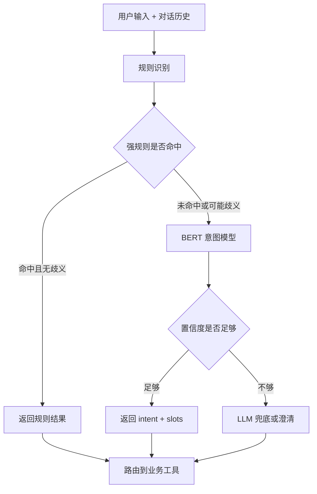
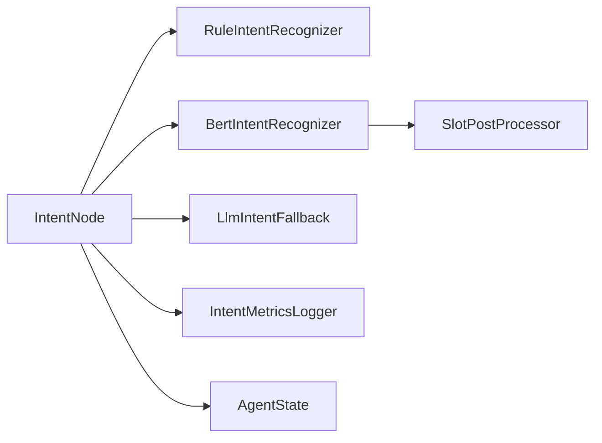
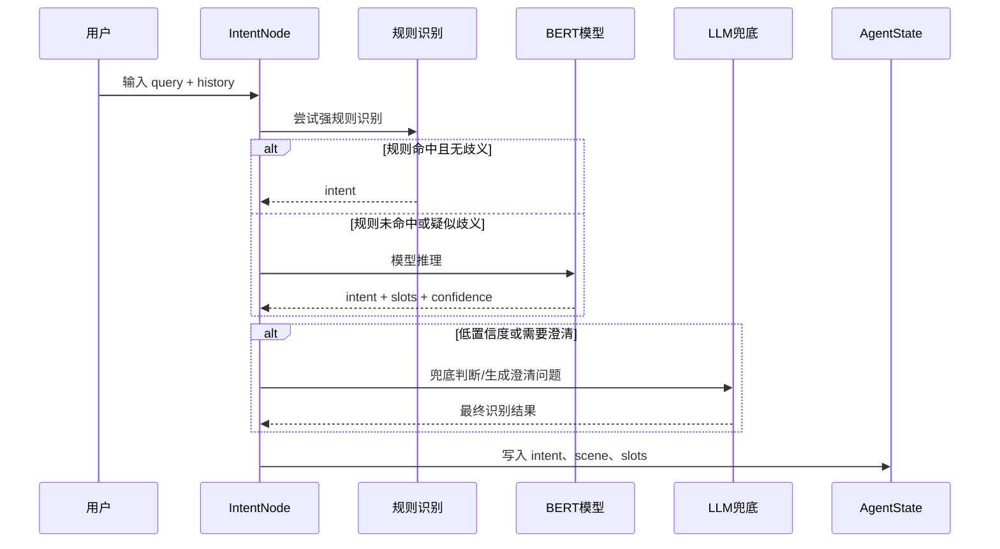
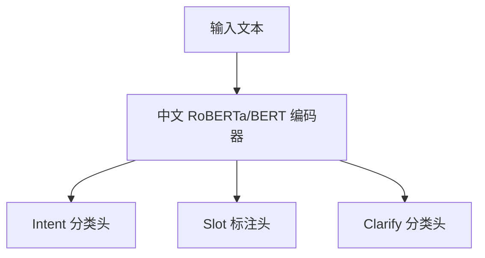

# 意图识别模型技术方案

## 1. 背景与问题

当前系统的意图识别主要靠两类能力：

1. 强关键词规则：比如看到“天气”就走天气，看到“查船”就走查船。
2. LLM 兜底：规则没识别出来时，让大模型判断用户想做什么。

这套方案能快速跑起来，但在航运业务里会遇到几个典型问题：

| 问题 | 示例 | 影响 |
|------|------|------|
| 船名和地名混淆 | “俞垛79”是船名，“俞垛”也可能是地名 | 查船被误判为地名问答 |
| 关键词不明显 | “南京到南通5000吨砂石料明天装” | 用户明明在找船/发货，但规则不一定命中 |
| 多轮上下文省略 | 上文查过“俞垛79”，下文问“俞垛在哪里” | 系统忘记上文，导致误判 |
| LLM 成本和稳定性 | 每次都请求大模型 | 响应慢、成本高、输出不稳定 |

因此，需要引入一个轻量、稳定、可本地部署的航运意图识别模型，专门处理规则覆盖不到、LLM 又显得过重的中间区域。

---

## 2. 目标与边界

### 2.1 第一阶段目标

第一阶段目标是“训练时覆盖全部意图标签，落地时按业务优先级逐步接入”。也就是说，模型需要从一开始就认识所有场景，但 P0 高频场景要优先保证数据量、评测指标和后端链路。

| 能力 | 目标 |
|------|------|
| 意图识别 | 判断用户属于哪个业务场景，包括查船、找船、录单、运价、水位、文档问答等 |
| 槽位抽取 | 抽取船名、区域、起点、终点、货物、吨位、时间等参数 |
| 多轮理解 | 当前问题信息不完整时，能从最近历史里继承关键信息 |
| 澄清判断 | 信息不足或多意图冲突时，不瞎猜，提示用户补充 |
| 工程接入 | 和现有 `IntentNode`、规则识别、LLM 兜底兼容 |

### 2.2 第一阶段完整 Intent 标签

第一阶段训练完整标签集，标签来源参考《场景强关键词》。

| Intent | 说明 | 示例 | 优先级 |
|--------|------|------|--------|
| DOC_QA | 文档问答/操作指引 | “运吨吨怎么发布运单” | P1 |
| FIND_SHIP | 找船、找运力、区域船舶分布 | “南京港附近有没有船” | P0 |
| SAVE_ORDER | 发布或录入运单 | “帮我录一条南京到重庆的砂石运单” | P0 |
| QUERY_ORDER | 历史订单/历史运单查询 | “帮我查一下之前的运单” | P0 |
| QUERY_SHIP | 查询单船位置、轨迹、到港时间 | “俞垛79在哪” | P0 |
| QUERY_FREIGHT | 运价/运费查询 | “武穴到南通砂石5000吨运价多少” | P0 |
| QUERY_WEATHER | 天气查询 | “南京港明天天气” | P0 |
| QUERY_WATER_LEVEL | 水位/水深/通航水深查询 | “南京到镇江这段水深多少” | P0 |
| DISPATCH_MONITOR | 在途监控/运输进度 | “查一下这票货运输进度” | P1 |
| IMAGE_OCR | 图片识别/提取文字 | “帮我识别一下这张运单图片” | P2 |
| FEEDBACK | 反馈/投诉/建议/报错 | “这个功能不好用，我要反馈” | P2 |
| QUERY_OIL_STATION | 加油站查询 | “附近哪里可以给船加油” | P1 |
| QUERY_SHIP_INFO | 船舶档案/船舶资料查询 | “华航118这条船的档案信息” | P1 |
| TALK | 闲聊 | “你好” | P2 |
| OTHER | 无法识别或暂不支持 | “帮我查股票” | P2 |

### 2.3 优先级说明

| 优先级 | 处理原则 |
|--------|----------|
| P0 | 高频主链路，第一阶段必须保证样本量、评测指标和后端路由 |
| P1 | 一起训练标签，但可按下游工具成熟度逐步接入 |
| P2 | 一起训练标签，线上可先由规则或兜底逻辑处理 |

---

## 3. 总体方案

采用“三层识别架构”：规则优先，BERT 小模型作为主力，LLM 兜底。



### 3.1 为什么不直接用纯规则

纯规则容易解释、响应快，但覆盖不了大量自然表达，例如：

1. “南京到南通5000吨砂石料明天装”
2. “俞垛在哪里”
3. “有没有船舶可以推荐”
4. “小吨同学搜索靖江附近6000吨左右的装煤炭的船”

这些句子要靠语义和上下文理解，规则会越来越复杂，后期维护成本很高。

### 3.2 为什么不直接全靠 LLM

LLM 理解能力强，但不适合每次都作为主链路：

1. 成本更高。
2. 延迟更大。
3. 输出格式不一定稳定。
4. 线上可控性不如本地模型。

因此 LLM 更适合做兜底、疑难问题判断、澄清问题生成，而不是承担全部意图识别流量。

### 3.3 为什么选择 BERT/RoBERTa

| 方案 | 结论 | 原因 |
|------|------|------|
| 纯规则 | 不作为主方案 | 覆盖不足，维护成本高 |
| 闭源 LLM API | 只做兜底 | 成本和稳定性不适合全量 |
| Qwen LoRA | 后续探索 | 训练和部署成本更高，第一阶段没必要 |
| BERT/RoBERTa | 第一阶段主方案 | 训练成熟、推理快、成本低、便于本地部署 |

推荐第一阶段使用 `hfl/chinese-roberta-wwm-ext` 或 `bert-base-chinese` 作为基础模型。

---

## 4. 模块设计

### 4.1 模块划分

| 模块 | 职责 | 不负责 |
|------|------|--------|
| RuleIntentRecognizer | 强关键词和确定性规则识别 | 复杂语义理解 |
| BertIntentRecognizer | 模型推理，输出 intent、slots、confidence、need_clarify | 生成自然语言回复 |
| LlmIntentFallback | 低置信度兜底、澄清问题生成 | 承担全部流量 |
| IntentNode | 编排三层识别流程，并写入 AgentState | 具体业务工具执行 |
| SlotPostProcessor | 对模型槽位做规则修正和归一化 | 判断最终意图 |
| IntentMetricsLogger | 记录识别结果、耗时、置信度和 bad case | 业务决策 |

### 4.2 模块关系



### 4.3 输出结构

统一输出结构如下：

```json
{
  "intent": "QUERY_SHIP",
  "confidence": 0.92,
  "method": "bert",
  "slots": {
    "ship_name": "俞垛79"
  },
  "need_clarify": false,
  "clarify_question": null
}
```

字段说明：

| 字段 | 说明 |
|------|------|
| intent | 识别出的业务意图 |
| confidence | 置信度，0 到 1 |
| method | 来源：rule、bert、llm、guard |
| slots | 抽取到的业务参数 |
| need_clarify | 是否需要用户补充信息 |
| clarify_question | 需要澄清时返回的问题 |

---

## 5. 识别流程设计

### 5.1 主流程



### 5.2 决策规则

| 情况 | 处理 |
|------|------|
| 强规则命中，且不是容易歧义的表达 | 直接使用规则结果 |
| 强规则命中，但存在上下文冲突 | 进入 BERT 判断 |
| BERT 置信度 >= 0.85 | 使用 BERT 结果 |
| BERT 置信度在 0.65 到 0.85 | 结合规则、历史和槽位二次判断 |
| BERT 置信度 < 0.65 | 进入 LLM 兜底 |
| `need_clarify=true` | 返回澄清问题，不继续调用业务工具 |

### 5.3 上下文继承规则

为了处理“俞垛在哪里”这类问题，需要在模型之外再加一层轻量上下文规则：

| 场景 | 处理方式 |
|------|----------|
| 当前 query 没有完整船名，但上一轮有船名 | 优先继承上一轮船名 |
| 当前 query 只有“在哪里/到哪了/多久到” | 若上文场景是查船，则优先判为 QUERY_SHIP |
| 当前 query 只有“附近/周边/这一片” | 若上文是找船或区域查询，则继承区域 |
| 当前 query 出现新明确意图 | 以当前 query 为准，不强行继承历史 |

---

## 6. 数据方案

详细训练数据方案见《03-BERT训练方案》，这里说明总体原则。

### 6.1 数据来源

| 来源 | 用途 |
|------|------|
| 业务真实话术 | 覆盖高频表达 |
| 问题样本 | 覆盖已知 bad case |
| 强关键词样本 | 校准规则和模型边界 |
| 人工补充样本 | 补齐低频场景 |
| 线上 bad case | 持续迭代模型 |

### 6.2 数据格式

统一使用 JSONL：

```json
{
  "history": [
    {"role": "user", "content": "查船 俞垛79"},
    {"role": "assistant", "content": "已为您查到船舶俞垛79的位置"}
  ],
  "query": "俞垛在哪里",
  "label": {
    "intent": "QUERY_SHIP",
    "slots": {
      "ship_name": "俞垛79"
    },
    "need_clarify": false
  }
}
```

### 6.3 数据量要求

| 类型 | 建议数量 |
|------|----------|
| 训练集 | 1500~3000 条 |
| 验证集 | 300~500 条 |
| 测试集 | 400~800 条 |
| 歧义专项测试集 | 100~200 条 |

如果第一批数据只有 300~500 条，也可以先训练验证方向，但只能作为技术预研版本，不建议直接作为稳定上线版本。正式训练集必须覆盖全部 intent，且每个 intent 都要进入验证集和测试集。

---

## 7. 模型方案

### 7.1 模型输入

输入由最近历史和当前问题组成，需要带角色标记：

```text
[H_USER] 查船 俞垛79
[H_ASSISTANT] 已为您查到船舶俞垛79的位置
[QUERY] 俞垛在哪里
```

### 7.2 模型输出

模型输出三类结果：

| 输出 | 说明 |
|------|------|
| intent | 意图分类 |
| slots | 槽位抽取 |
| need_clarify | 是否需要澄清 |

### 7.3 模型结构



### 7.4 训练细节

训练配置、损失函数、指标和数据标注细节统一放在《03-BERT训练方案》中维护，避免两份文档重复和冲突。

---

## 8. 后端改造方案

### 8.1 AgentState 扩展

当前 `IntentInfo` 只有 `intent/confidence/method`，需要支持槽位和澄清信息：

```python
class IntentInfo(BaseModel):
    intent: str
    confidence: float
    method: str
    slots: dict[str, Any] = {}
    need_clarify: bool = False
    clarify_question: str | None = None
```

### 8.2 IntentService 改造

建议拆成三类能力：

| 方法 | 说明 |
|------|------|
| `recognize_by_rule` | 保留现有规则识别 |
| `recognize_by_bert` | 新增 BERT 模型识别 |
| `recognize_by_llm` | 保留 LLM 兜底 |

### 8.3 配置开关

需要新增配置：

| 配置 | 默认值 | 说明 |
|------|--------|------|
| ENABLE_BERT_INTENT | false | 是否启用 BERT 意图识别 |
| BERT_INTENT_MODEL_PATH | 空 | 模型路径 |
| BERT_INTENT_CONFIDENCE_HIGH | 0.85 | 高置信度阈值 |
| BERT_INTENT_CONFIDENCE_LOW | 0.65 | 低置信度阈值 |

上线初期默认关闭，通过配置灰度开启。

---

## 9. 监控与评测

### 9.1 离线评测指标

| 指标 | 目标 |
|------|------|
| Intent Accuracy | >= 88% |
| Intent Macro F1 | >= 82% |
| Slot Entity F1 | >= 78% |
| Exact Match | >= 65% |
| Clarify Recall | >= 80% |
| Clarify Precision | >= 60% |

### 9.2 线上监控指标

| 指标 | 说明 |
|------|------|
| intent 分布 | 防止某类异常暴涨 |
| method 分布 | 观察 rule、bert、llm 的占比 |
| 低置信度比例 | 判断模型是否稳定 |
| 澄清触发率 | 防止过度追问 |
| 推理耗时 | 防止影响接口响应 |
| bad case 数量 | 持续回流训练 |

---

## 10. 上线策略

### 10.1 分阶段上线

| 阶段 | 说明 | 是否影响用户 |
|------|------|--------------|
| 离线评测 | 用固定测试集验证效果 | 否 |
| 影子模式 | 线上记录模型结果，但不参与决策 | 否 |
| 小流量灰度 | 少量请求使用 BERT 结果 | 是 |
| 扩大灰度 | 指标稳定后扩大比例 | 是 |
| 全量上线 | 保留配置开关和 LLM 兜底 | 是 |

### 10.2 回滚条件

出现以下情况立即关闭 `ENABLE_BERT_INTENT`：

1. 查船、找船、录单等核心意图误判明显增加。
2. 模型推理耗时影响聊天接口。
3. 澄清问题触发过多，用户体验变差。
4. 模型服务异常导致主流程不可用。

---

## 11. 里程碑

| 阶段 | 时间 | 目标 | 交付物 |
|------|------|------|--------|
| M1 标签与数据准备 | 第 1~2 周 | 明确标签边界，完成第一批样本 | 标签规范、JSONL 数据集 |
| M2 离线模型验证 | 第 3~4 周 | 跑通训练和评测 | checkpoint、评测报告 |
| M3 后端影子接入 | 第 5 周 | 接入 IntentNode，但不影响线上决策 | BertIntentService、日志指标 |
| M4 小流量灰度 | 第 6~7 周 | 验证线上稳定性 | 灰度报告、bad case 列表 |
| M5 迭代扩展 | 第 8 周后 | 扩展更多意图和样本 | V2 数据集、V2 模型 |

---

## 12. 最终结论

第一阶段不建议直接做“大而全”的意图模型，也不建议完全替换现有规则和 LLM。

推荐路线是：

```text
强规则保留
  + BERT/RoBERTa 负责高频业务语义识别
  + LLM 负责低置信度兜底和澄清
  + 线上 bad case 持续回流
```

这条路线成本低、上线风险可控，也能逐步解决“船名地名歧义”“多轮省略”“找船和查船混淆”等当前最关键的问题。
