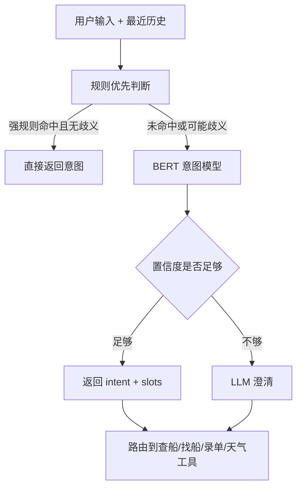
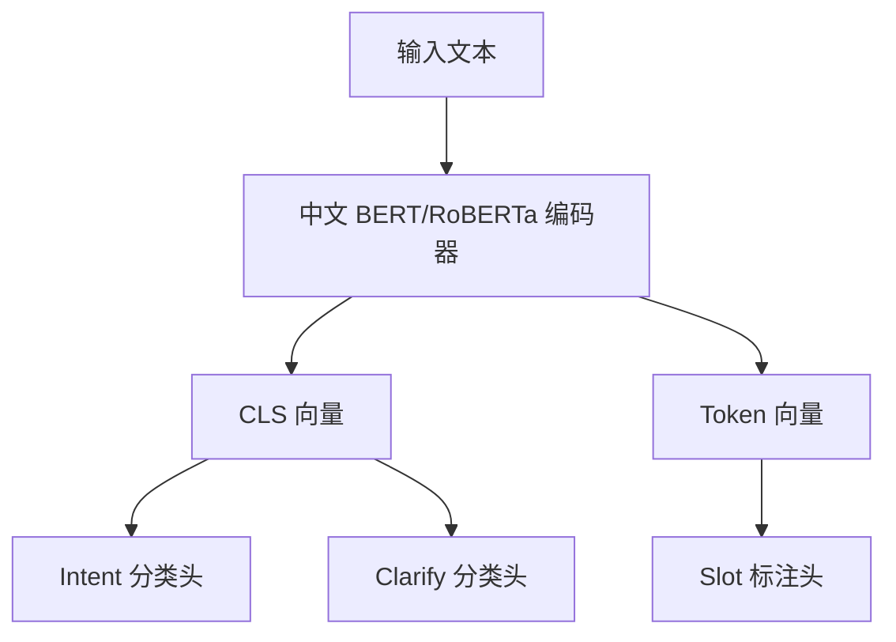
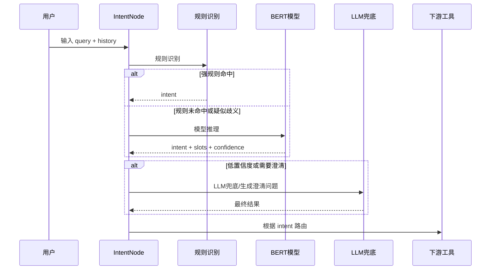

# BERT 意图识别模型训练方案

## 1. 问题原因

当前意图识别主要依赖规则和 LLM 兜底，容易在复杂问题场景里出错：

1. 用户说“俞垛在哪里”，系统不知道是在问地名，还是在追问上一轮的船“俞垛79”。
2. “南京7”可能是船名，“南京港”又是区域，单靠关键词很难判断。
3. “南京到南通5000吨砂石料明天装”这种话没有明显动词，但业务上应该识别为找船或发布运单。
4. LLM 可以兜底，但成本、稳定性、响应时间都不如本地小模型可控。

先训练一个轻量的航运意图识别模型。模型第一阶段就覆盖完整意图标签，但数据建设、评测验收和后端接入按 P0/P1/P2 优先级推进。

---

## 2. 建设目标

### 2.1 第一阶段目标

| 能力 | 说明 |
|------|------|
| 意图识别 | 判断用户是在查船、找船、录运单、查天气，还是闲聊/其他 |
| 槽位抽取 | 从用户话术里抽出船名、区域、起点、终点、货物、吨位、时间 |
| 上下文继承 | 用户省略关键信息时，从最近历史里补齐，例如“俞垛在哪里”继承“俞垛79” |
| 低置信度兜底 | 模型不确定时不瞎猜，交给规则/LLM 或触发澄清 |


## 3. 整体技术路线

采用“关键词优先 + BERT 小模型 + LLM 兜底”的三层结构。



这样做的好处：

1. 强关键词仍然保留，简单问题不需要走模型。
2. BERT 负责处理“像业务话但关键词不明显”的输入。
3. LLM 只处理少量疑难问题，并且触发追问，降低成本和不稳定性。

---

## 4. 标签体系设计

### 4.1 第一阶段 Intent 标签

第一阶段需要训练完整意图标签，标签来源参考《场景强关键词》。这样模型从一开始就知道所有业务出口，避免把暂时样本少的场景都误判到 `OTHER`。

训练时可以按优先级分批补数据，但标签集合必须一次性固定下来；否则后续新增标签会导致模型、评测集和后端路由反复返工。

| Intent | 中文说明 | 示例 | 后端路由               |
|--------|----------|------|--------------------|
| DOC_QA | 文档问答/操作指引 | “运吨吨怎么发布运单” | RAG/文档问答           |
| FIND_SHIP | 找船/找运力/区域船舶分布 | “南京港附近有没有船” | 找船工具               |
| SAVE_ORDER | 发布/录入运单 | “帮我录一条南京到重庆的砂石运单” | 运单录入               |
| QUERY_ORDER | 历史订单/历史运单查询 | “帮我查一下之前的运单” | 运单查询               |
| QUERY_SHIP | 查询单船位置/轨迹/到港时间 | “俞垛79在哪” | 查船工具               |
| QUERY_FREIGHT | 运价/运费查询 | “武穴到南通砂石5000吨运价多少” | 运价工具               |
| QUERY_WEATHER | 天气查询 | “南京港明天天气” | 天气工具               |
| QUERY_WATER_LEVEL | 水位/水深/通航水深查询 | “南京到镇江这段水深多少” | 水位工具               |
| DISPATCH_MONITOR | 在途监控/运输进度 | “查一下这票货运输进度” | 在途监控               |
| IMAGE_OCR | 图片识别/提取文字 | “帮我识别一下这张运单图片” | OCR 工具             |
| FEEDBACK | 反馈/投诉/建议/报错 | “这个功能不好用，我要反馈” | 反馈入口               |
| QUERY_OIL_STATION | 加油站查询 | “附近哪里可以给船加油” | 加油站查询              |
| QUERY_SHIP_INFO | 船舶档案/船舶资料查询 | “华航118这条船的档案信息” | 船舶档案               |
| TALK | 闲聊 | “你好” | 闲聊回复 兜底回复/LLM 澄清场景 |

### 4.2 标签优先级

虽然第一阶段训练全部标签，但数据建设和验收可以分优先级推进：

| 优先级 | Intent                                                              | 说明 |
|--------|---------------------------------------------------------------------|------|
| P0 | FIND_SHIP、QUERY_SHIP、QUERY_FREIGHT、TALK    | 高频业务主链路，必须有足够样本和稳定指标 |
| P1 | DOC_QA、DISPATCH_MONITOR、QUERY_SHIP_INFO、SAVE_ORDER、QUERY_OIL_STATION、QUERY_ORDER、QUERY_WATER_LEVEL | 需要和下游工具/RAG/业务接口一起联调 |
| P2 | IMAGE_OCR、FEEDBACK、QUERY_WEATHER                         | 可先用规则兜底，但训练集中必须保留，避免误召回 |

### 4.3 第一阶段 Slot 标签

第一阶段先抽通用关键槽位，关键信息有助于意图识别。

| Slot | 中文说明 | 示例 |
|------|----------|------|
| ship_name | 船名 | 俞垛79、华航118、长江之星6号 |
| area_name | 区域/附近范围 | 南京港附近、江北一带 |
| port_name | 港口/码头 | 南京龙潭港、重庆果园港 |
| route_from | 起点/装货地 | 南京、镇江港 |
| route_to | 终点/卸货地 | 重庆、武汉阳逻 |
| cargo_name | 货名 | 砂石、煤炭、钢材 |
| cargo_weight | 吨位/数量 | 3000吨、5000吨左右、1万吨 |
| date_time | 时间/装期 | 明天、月底、3月15号 |

BIO 标签示例：

```text
输入：南京 到 南通 5000吨 砂石料 明天 装
标签：B-from O B-to B-weight B-cargo B-date O
```

注意：中文分词容易切错，训练时建议使用 tokenizer 后的 token 对齐策略；实体级评估要以完整实体为准，不只看单字是否命中。

---

## 5. 模型设计

### 5.1 模型结构

使用中文预训练编码器，例如 `bert-base-chinese`。



输出包含三部分：

| 输出 | 说明 |
|------|------|
| intent | 用户意图 |
| slots | 抽取到的业务参数 |
| need_clarify | 是否需要澄清 |

### 5.2 Clarify 分类头

原方案只设计了 intent 和 slot，但业务里有很多“不能瞎猜”的问题，例如：

| 用户输入 | 应该怎么处理 |
|----------|--------------|
| “在哪里” | 如果上文有船名，可以继承查船 |
| “南京附近” | 可能是找船，也可能是查天气，需要结合上下文 |
| “帮我查一下” | 信息不足，应该追问 |

所以需要增加一个简单的 `need_clarify` 分类：

| 标签 | 说明 |
|------|------|
| false | 信息足够，可以路由 |
| true | 信息不足或多意图冲突，需要澄清 |

---

## 6. 输入格式设计

### 6.1 推荐输入格式

不要只把历史内容简单拼起来，要明确标记角色和当前问题。

```text
[H_USER] 查船 俞垛79
[H_ASSISTANT] 已为您查到船舶俞垛79的位置
[QUERY] 俞垛在哪里
```

这样模型更容易理解：

1. 哪些是历史内容。
2. 哪一句是当前用户真正的问题。
3. 当前问题是否需要从历史里继承船名。

### 6.2 历史截断策略

| 内容 | 策略 |
|------|------|
| 历史轮数 | 最多保留最近 3 轮 |
| 最大长度 | 建议 `max_length=256`，长运单样本可放宽到 384 |
| 截断优先级 | 优先保留当前 query，其次保留最近一轮历史 |

---

## 7. 数据准备方案

### 7.1 数据来源

| 来源 | 用途 |
|------|------|
| 真实业务话术样本 | 覆盖高频表达 |
| 问题样本 | 覆盖 bad case，例如“俞垛在哪里” |
| 强关键词样本 | 作为规则和模型共同基线 |
| 人工补充样本 | 补齐少数类和边界样本 |
| 线上 bad case 回流 | 持续提升模型 |

### 7.2 样本格式

建议统一保存为 JSONL，一行一个样本。

```json
{
  "id": "sample_0001",
  "history": [
    {"role": "user", "content": "查船 俞垛79"},
    {"role": "assistant", "content": "已为您查到船舶俞垛79的位置"}
  ],
  "query": "俞垛在哪里",
  "label": {
    "intent": "QUERY_SHIP",
    "slots": {
      "ship_name": "俞垛79"
    },
    "need_clarify": false
  }
}
```

澄清样本示例：

```json
{
  "id": "sample_0102",
  "history": [],
  "query": "帮我查一下",
  "label": {
    "intent": "OTHER",
    "slots": {},
    "need_clarify": true,
    "clarify_question": "请问您想查船、找船、查天气，还是处理运单？"
  }
}
```

### 7.3 第一阶段样本量建议

原方案的 300~500 条可以做验证，但作为稳定上线标准尚且不够。按下面数量准备：

| 类型 | 建议数量 | 说明 |
|------|----------|------|
| 训练集 | 1500~3000 条 | 覆盖全部 intent，P0 场景样本要更充足 |
| 验证集 | 300~500 条 | 调参和早停，每个 intent 都要有样本 |
| 测试集 | 400~800 条 | 固定不动，只做最终评测 |
| 歧义专项集 | 100~200 条 | 专门测试上下文继承和澄清 |

每个 intent 至少准备 80~100 条以上；P0 场景建议每类 200 条以上，否则 Macro F1 不稳定，其他场景也容易被误判成高频场景。

样本来源：1.历史真实对话数据 2.LLM5.5补充 3.业务部门人工创建


### 7.4 数据划分原则

不要随机打散所有样本就结束，还要做分层划分：

1. 每个 intent 在训练、验证、测试里都要有样本。
2. 同一个模板改写出来的相似样本不要同时出现在训练集和测试集。
3. 歧义专项测试集固定不动，用来长期观察模型是否真的解决核心问题。
4. 真实线上 bad case 优先放入测试集，再补充到下一轮训练集。

---

## 8. 训练配置

### 8.1 超参数预设（参考LLM-TITA）

| 参数 | 建议值 | 说明 |
|------|--------|------|
| base_model | hfl/chinese-roberta-wwm-ext | 中文业务文本效果通常比原始 BERT 更好 |
| max_length | 256 | 兼顾多轮上下文和性能 |
| batch_size | 16 | 显存不足可调成 8 |
| learning_rate | 2e-5 | BERT 微调常用学习率 |
| epochs | 5~8 | 配合 early stopping，不建议固定训满 |
| warmup_ratio | 0.1 | 前期稳定训练 |
| weight_decay | 0.01 | 防止过拟合 |
| intent_loss_weight | 1.0 | 意图分类权重 |
| slot_loss_weight | 0.5 | 槽位抽取权重 |
| clarify_loss_weight | 0.5 | 澄清判断权重 |

### 8.2 损失函数

```text
Total Loss =
  1.0 * Intent CrossEntropy
  + 0.5 * Slot CrossEntropy
  + 0.5 * Clarify CrossEntropy
```

如果后续发现槽位抽取效果差，可以把 `slot_loss_weight` 提高到 `0.8` 或 `1.0`。

---

## 9. 推理与后端接入方案

### 9.1 推理输出格式

模型服务统一输出：

```json
{
  "intent": "QUERY_SHIP",
  "confidence": 0.92,
  "slots": {
    "ship_name": "俞垛79"
  },
  "need_clarify": false,
  "clarify_question": null,
  "method": "bert"
}
```

### 9.2 后端状态结构需要扩展

当前 `IntentInfo` 只有 `intent/confidence/method`，需要扩展为：

```python
class IntentInfo(BaseModel):
    intent: str
    confidence: float
    method: str
    slots: dict[str, Any] = {}
    need_clarify: bool = False
    clarify_question: str | None = None
```

### 9.3 接入顺序



### 9.4 置信度策略

| 情况 | 处理方式 |
|------|----------|
| confidence >= 0.85 且 need_clarify=false | 直接使用模型结果 |
| 0.65 <= confidence < 0.85 | 结合规则、历史上下文做二次判断 |
| confidence < 0.65 | 交给 LLM 兜底或让用户澄清 |
| need_clarify=true | 优先返回澄清问题 |

---

## 10. 评测方案

### 10.1 主指标

| 指标 | 目标值 | 说明 |
|------|--------|------|
| Intent Accuracy | >= 88% | 整体意图准确率 |
| Intent Macro F1 | >= 82% | 防止只在大类上表现好 |
| Slot Entity F1 | >= 78% | 按完整实体评估，不只看 token |
| Exact Match | >= 65% | intent 和 slots 都正确 |
| Clarify Recall | >= 80% | 该澄清的问题要能拦住 |
| Clarify Precision | >= 60% | 不要过度澄清 |

### 10.2 必测样例（从已有bad case测试表现）

| 输入 | 预期 |
|------|------|
| “查船 俞垛79” | QUERY_SHIP，ship_name=俞垛79 |
| 上文查过“俞垛79”，当前问“俞垛在哪里” | QUERY_SHIP，ship_name=俞垛79 |
| “南京港附近有没有船” | FIND_SHIP，area_name=南京港附近 |
| “南京到南通5000吨砂石料明天装” | FIND_SHIP 或 SAVE_ORDER，根据产品规则固定一种 |
| “帮我查一下” | need_clarify=true |
| “南京港明天天气” | QUERY_WEATHER，port_name=南京港，date_time=明天 |

### 10.3 基线对比

上线前必须和当前方案对比：

| 方案 | 说明 |
|------|------|
| 当前规则 | `IntentService.KEYWORD_RULES` |
| 当前 LLM | 现有 `recognize_by_llm` |
| 新 BERT | 本方案训练模型 |
| 规则 + BERT + LLM | 最终接入形态 |

只有当“规则 + BERT + LLM”的综合效果优于现有方案，才批准上线。

---

## 11. 上线方案

直接上线生产 没有策略

---

## 12. 开发任务拆解

### 12.1 数据任务

| 任务 | 产出物 | 验收标准 |
|------|--------|----------|
| 整理 intent 标签规范 | 标签说明文档 | 每个标签有定义、正例、反例 |
| 整理 slot 标注规范 | BIO 标注规范 | 标注员能按规则一致标注 |
| 制作第一批 JSONL 样本 | train/valid/test 数据集 | 格式校验通过 |
| 制作歧义专项测试集 | ambiguity_test.jsonl | 覆盖船名地名、多轮省略、多意图冲突 |

### 12.2 模型任务

| 任务 | 产出物 | 验收标准 |
|------|--------|----------|
| 实现 Dataset 和 tokenizer 对齐 | 训练数据加载代码 | BIO 标签和 token 对齐正确 |
| 实现联合模型 | intent + slot + clarify 模型 | 单批训练可跑通 |
| 实现训练脚本 | train.py | 可保存 checkpoint |
| 实现评测脚本 | evaluate.py | 输出 Accuracy/F1/Exact Match |
| 导出模型 | PyTorch 或 ONNX | 本地可加载推理 |

### 12.3 后端任务

| 任务 | 产出物 | 验收标准 |
|------|--------|----------|
| 扩展 IntentInfo | 状态结构支持 slots/clarify | 单元测试通过 |
| 新增 BertIntentService | 模型推理服务封装 | 输入 query/history 输出标准 JSON |
| 改造 IntentNode | 规则 -> BERT -> LLM 三层识别 | 兼容原有规则 |
| 增加配置开关 | ENABLE_BERT_INTENT | 可随时关闭模型 |
| 增加日志指标 | intent、confidence、method、耗时 | 方便后续 bad case 分析 |

### 12.4 测试任务

| 任务 | 产出物 | 验收标准 |
|------|--------|----------|
| 单元测试 | tests/unit/test_services_intent.py | 覆盖规则、BERT、LLM 兜底 |
| 集成测试 | chat API 测试 | 能正确路由到下游工具 |
| 回归测试 | 固定 bad case 集 | “俞垛在哪里”等问题不再误判 |
| 性能测试 | 推理耗时报告 | 单次推理满足接口延迟要求 |

---

## 13. 关键风险与应对

| 风险 | 表现 | 应对 |
|------|------|------|
| 数据量太少 | 测试集指标虚高，上线误判多 | 先影子模式，不直接全量；持续回流 bad case |
| 标签边界不清 | FIND_SHIP 和 SAVE_ORDER 混淆 | 产品侧先固定判定规则，并写入标注规范 |
| 船名地名歧义 | “俞垛”被当成地名 | 增加上下文样本和船名词典特征 |
| 槽位抽取不稳定 | 吨位、港口抽错 | 增加实体级评估和规则后处理 |
| 模型不可用 | 服务异常影响聊天 | 保留规则和 LLM 兜底，增加开关回滚 |

---

## 14. 最终交付物

需要交付：

1. 标签规范文档。
2. 标注后的 JSONL 数据集。
3. 训练脚本、评测脚本、推理脚本。
4. 模型 checkpoint 或 ONNX 文件。
5. 离线评测报告。
6. 后端接入代码。
7. 上线和回滚配置。
8. bad case 回流机制。
